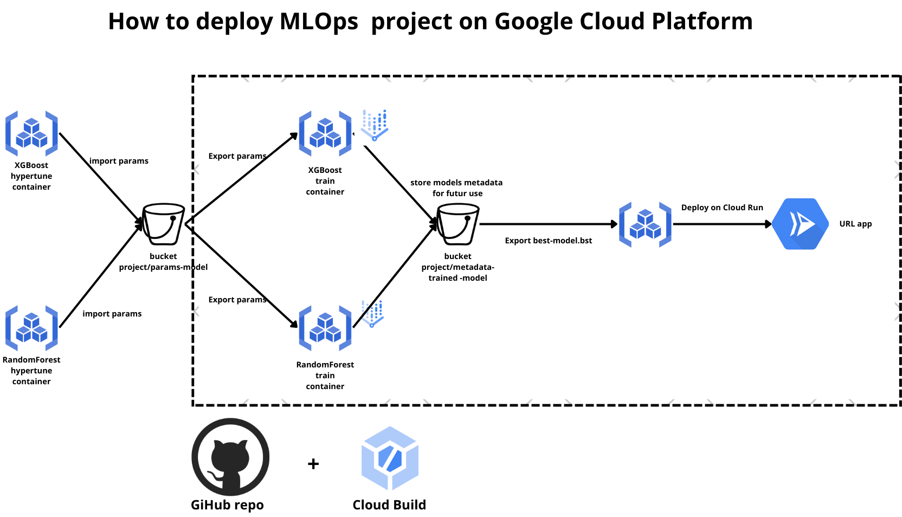
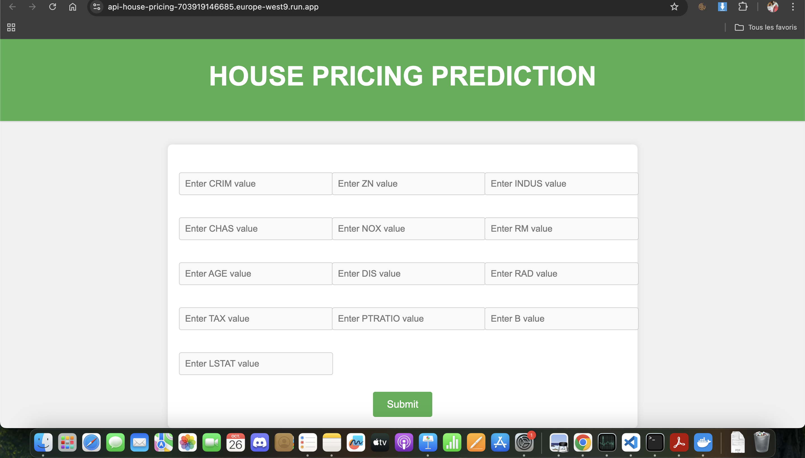
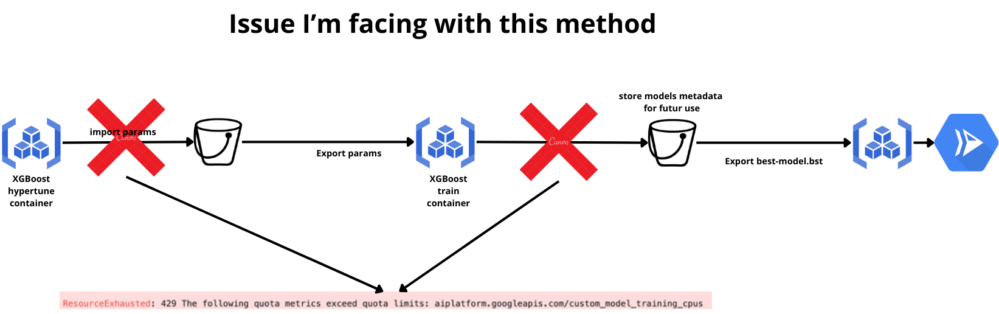
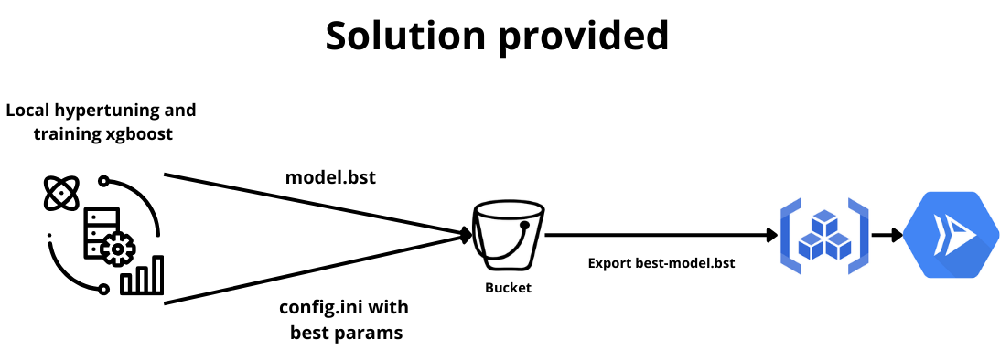

# house-pricing-project

# Vertex Ai Hyperparams Tuning, Model Training and deploying API Flask Prediction on Google Cloud

The goal of this repo is to explain how to fine tune hyper parameters for 2 models (xgboost and RandomForest) and then train it on Vertex Ai, in order to deploy these models for real-time prediction.

Init steps :
- create a free Google Cloud account
- create a new project
- install Cloud and Vertex SDK
- activate API's (Notebook, Registry, Vertex, Compute engine...)
- create a bucket dedicated to this project, which will contains hypertune and train artifacts 

Model deploying steps :  
- We will create a container for the hyperparameter tuning task for each model.
- Start the CustomJob and save the best hyperparameters to the destination bucket.
- Then, we will create a new container for the training task for each model, importing the hyperparameters from the previous bucket.
- Start the CustomJob and save the ```model.bst``` file to the destination bucket.
- We create the application container, using the ```model.bst``` file from the bucket to make predictions.
- Deploy the Flask API app on Cloud Run. Here is the link to the app if you’d like to try it: https://api-house-pricing-703919146685.europe-west9.run.app



Here is an example of the Flask API :  


Workflow from a Git repository using Cloud Build :  
- connect the git repo to Cloud Build
- Add an YAML filewith instructions to reload training container and new model.bst on the bucket
- Create a build trigger


Here is some issue I faced during this project :  

- CPU quotas error when I try to start a CustomJob : 



- I didn't have the time to try with RandomForest model
- I didn't manage to use the best hyperparams from the Hypertune task. I saved them in a config.ini file instead in the bucket
- I didn't manage to deploys the model to production when tests pass (new model outperforms old).  


Instead, I focused on training a single model (XGBoost) locally on my computer, then manually uploaded the weights (`model.bst`) and parameters (`config.ini`) to the bucket. We will still keep the containers for hyperparameter tuning and training.



How to use this repo : 

```Git clone https://github.com/Avicenne-ctrl/house-pricing-project.git```

However, you won’t be able to use the app directly, as it requires Admin authorization. To get started, create your own Google Cloud account and project, then follow the steps provided in each Notebook subfolder.


